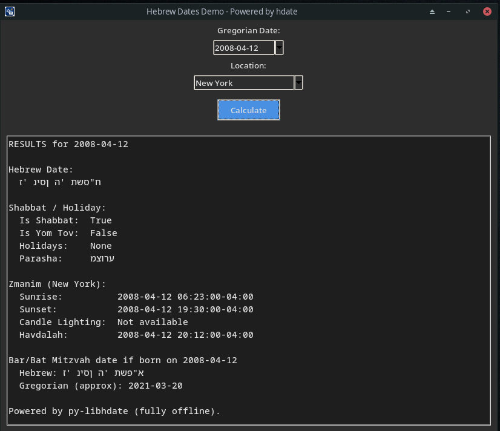

# HebrewDatesDemo

> [!IMPORTANT]
> This application is **EXCLUSIVELY a demo version** created to demonstrate the capabilities of the Python `hdate` / `py-libhdate` library.  
> It is **NOT intended for production use**, religious rulings, halachic decisions, or critical calendar calculations.

A small offline desktop application written in Python + Tkinter that demonstrates Hebrew/Jewish calendar calculations using the `hdate` library.

The app showcases:
- Hebrew date conversion
- Jewish holidays
- Parasha calculation
- Sunrise and sunset times
- Candle lighting and Havdalah
- Bar/Bat Mitzvah date calculations
- Multi-location zmanim support

---

# Screenshot



---

# Features

## Hebrew Calendar
- Gregorian → Hebrew date conversion
- Hebrew leap year support
- Holiday detection
- Shabbat and Yom Tov detection

## Zmanim
- Sunrise
- Sunset
- Candle lighting
- Havdalah

## Locations Included
- Jerusalem
- Tel Aviv
- New York
- London
- Moscow
- Saint Petersburg
- Novosibirsk
- Yekaterinburg
- Kazan
- Nizhny Novgorod
- Chelyabinsk
- Samara
- Omsk
- Rostov-on-Don

## Additional Demo Logic
- Approximate Bar/Bat Mitzvah Gregorian date calculation

---

# Technology Stack

- Python 3.10+
- Tkinter
- tkcalendar
- py-libhdate (`hdate`)
- PyInstaller

---

# Running From Source

## Install

```bash
pip install -r requirements.txt
````

## Start

```bash
python main.py
```

---

# Building Standalone Application

## Install build dependencies

```bash
pip install .[dev]
```

## Build with PyInstaller

### macOS

```bash
pyinstaller \
  --noconfirm \
  --clean \
  --windowed \
  --name "HebrewDatesDemo" \
  --collect-all=tkcalendar \
  --collect-all=babel \
  --hidden-import=babel.numbers \
  --icon=assets/icon.icns \
  --add-data="assets:assets" \
  main.py
```

### Linux

```bash
pyinstaller \
  --noconfirm \
  --clean \
  --windowed \
  --name "HebrewDatesDemo" \
  --collect-all=tkcalendar \
  --collect-all=babel \
  --hidden-import=babel.numbers \
  --icon=assets/icon.png \
  --add-data="assets:assets" \
  main.py
```

### Windows

```powershell
pyinstaller `
  --noconfirm `
  --clean `
  --windowed `
  --name "HebrewDatesDemo" `
  --collect-all=tkcalendar `
  --collect-all=babel `
  --hidden-import=babel.numbers `
  --icon=assets/icon.ico `
  --add-data "assets;assets" `
  main.py
```

Built applications will appear inside:

```text
dist/
```

---

# Download Prebuilt Versions

Prebuilt binaries are available in:

## GitHub [Releases](https://github.com/edyatl/hebrew-dates-demo/releases)

- macOS `.zip`
    
- Linux `.tar.gz`
    
- Windows `.zip`
    

---

# macOS Security Warning

Because demo builds are not Apple-notarized, macOS may show:

> “Apple could not verify…”

To open:

1. Right click the app
    
2. Select **Open**
    
3. Click **Open** again
    

This only needs to be done once.

---

# License

MIT License

---

# Credits

Powered by the `hdate` / `py-libhdate` library.

Main project:

- [https://github.com/py-libhdate/py-libhdate](https://github.com/py-libhdate/py-libhdate)
    

---

# Disclaimer

This software is provided ONLY as a technical demonstration project.

Do not rely on this application for:

- halachic rulings
    
- official zmanim
    
- legal/religious time calculations
    
- critical scheduling
    

Always verify important dates and times using trusted religious authorities or certified calendar sources.
